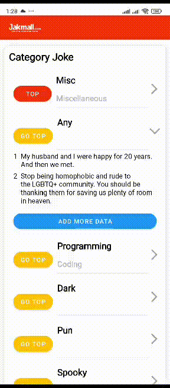

# Technical Test Project

## Overview

Proyek ini adalah aplikasi Android yang dikembangkan untuk keperluan technical test. Aplikasi ini menampilkan daftar lelucon (jokes) yang diperoleh dari API eksternal dan memiliki beberapa fitur interaktif.

## Features

- **Swipe Refresh**: Menarik halaman ke bawah untuk memuat ulang data.
- **Add More Data**: Menambahkan dua data tambahan setiap kali ditekan. Setelah dua kali penambahan, tombol akan menghilang.
- **Button Top**: Memindahkan data yang dipilih ke posisi teratas dalam daftar.
- **Joke Click Alert**: Klik pada sebuah joke akan menampilkan alert dialog dengan isi dari joke tersebut.
- **Shimmer Loading**: Efek shimmer digunakan saat data sedang dimuat untuk meningkatkan pengalaman pengguna.

## Data Source

Aplikasi ini mengambil data dari API berikut:

- **Kategori Joke**: [https://v2.jokeapi.dev/categories](https://v2.jokeapi.dev/categories)
- **Jokes Berdasarkan Kategori**: [https://v2.jokeapi.dev/joke/{category}?type=single&amount=2](https://v2.jokeapi.dev/joke/{category}?type=single&amount=2)

## Tech Stack

- **Kotlin** dengan Gradle Kotlin DSL
- **Jetpack Compose** (hanya untuk Splash Screen)
- **XML Layout** untuk Dashboard Activity
- **RxJava** untuk pemrograman reaktif
- **Hilt Dagger** untuk Dependency Injection
- **Retrofit** untuk komunikasi dengan API
- **RecyclerView** untuk menampilkan daftar data (jika digunakan di beberapa bagian)
- **MVVM (Model-View-ViewModel)** sebagai arsitektur desain pattern
- **Shimmer** untuk efek loading animasi

## Installation

1. Clone repository ini:
   ```sh
   git clone https://github.com/ryancode-commit/jokeapp.git
   ```
2. Buka di Android Studio.
3. Jalankan aplikasi menggunakan emulator atau perangkat fisik.

## GIF




## Author

Ryan Ardyansyah

